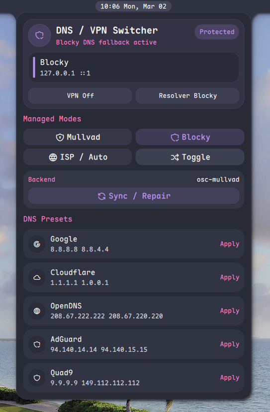
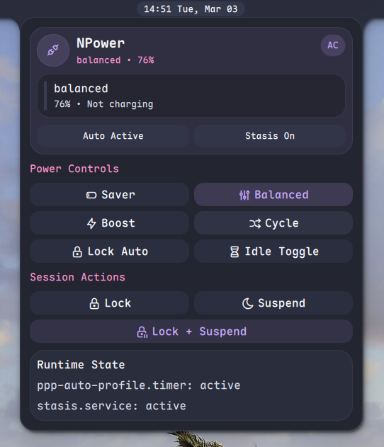
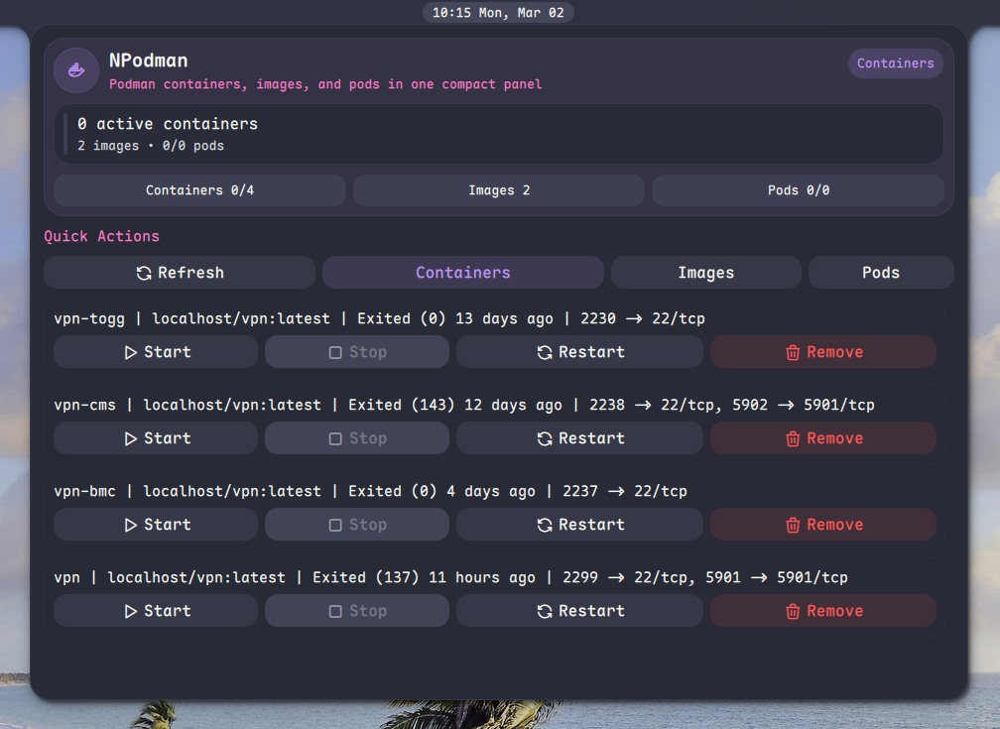
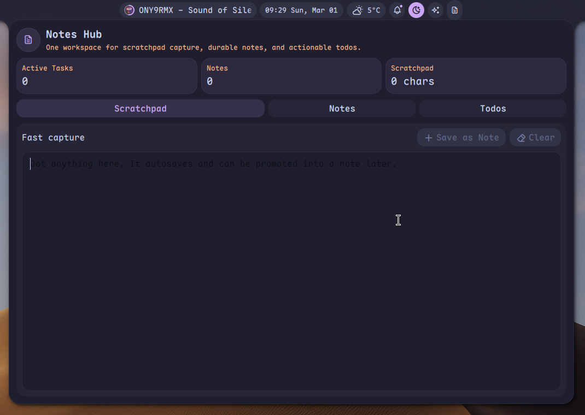
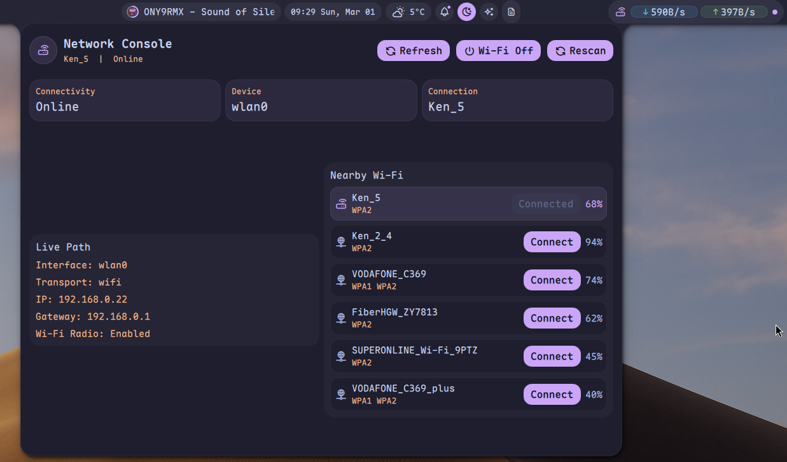
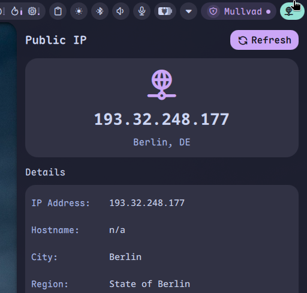

# Noctalia NPlugins

A curated third-party plugin registry for Noctalia, built around practical workflows, polished UI, and system-aware utilities.

This repository is designed to be used as a custom Noctalia plugin source. Noctalia reads `registry.json`, then installs individual plugin directories from this repository.

## Included Plugins

| [ <b>NDNS</b>](ndns) | [ <b>NPower</b>](npower) | [ <b>NPodman</b>](npodman) |
| :--- | :--- | :--- |
| DNS and VPN switching for Mullvad, Blocky, and direct DNS presets. | Laptop power profile, battery, and session controls in one panel. | Compact Podman dashboard for containers, images, and pods. |
| [ <b>Notes Hub</b>](notes) | [ <b>Network Console</b>](network) | [ <b>NIP</b>](nip) |
| Unified scratchpad, note cards, and todo workflow. | Live NetworkManager view with Wi-Fi visibility and quick actions. | Compact public IP monitor with an icon-only bar presence. |
| [ <b>NUFW</b>](nufw) | [ <b>NSunsetr</b>](nsunsetr) | |
| UFW firewall status, quick actions, and rule overview. | Sunsetr schedule, live Kelvin state, and quick preset controls. | |

## Repository Structure

- `registry.json`: plugin index consumed by Noctalia custom sources
- `ndns/`: DNS and VPN control plugin
- `npower/`: power profile and session actions plugin
- `npodman/`: Podman management plugin
- `notes/`: productivity workspace plugin
- `network/`: network status and Wi-Fi control plugin
- `nip/`: public IP monitoring plugin
- `nufw/`: UFW firewall control plugin
- `nsunsetr/`: sunsetr schedule and display control plugin

## Add This As A Noctalia Source

Add one of the following repository URLs in Noctalia plugin sources:

- `https://github.com/kenanpelit/noctalia-nplugins`
- `git@github.com:kenanpelit/noctalia-nplugins.git`

After adding the source, Noctalia will:

1. Fetch `registry.json`
2. List available plugins from this repository
3. Install the selected plugin subdirectory

## Runtime Requirements

Some plugins depend on external system tools. The main runtime requirements are:

### NDNS

`ndns` uses external commands to manage DNS and VPN state:

- `osc-mullvad`
- `mullvad`
- `nmcli`
- `sudo -n` or `pkexec` when stopping `blocky.service` during direct DNS changes

`ndns` resolves `osc-mullvad` in this order:

1. `PATH`
2. `$HOME/.local/bin/osc-mullvad`

Reference implementation:

- `https://github.com/kenanpelit/cachyos/blob/main/modules/scripts/bin/osc-mullvad.sh`

### NPower

`npower` relies on the local power stack:

- `powerprofilesctl`
- `systemctl`
- `loginctl`
- `qs` (for Noctalia idle inhibitor and lock actions)

It also reads:

- `/sys/class/power_supply/*`
- `ppp-auto-profile.timer`
- `stasis.service`

### NPodman

`npodman` requires:

- `podman`

It interacts with the local user-session Podman CLI directly.

### Network Console

`network` requires:

- `nmcli`
- a running NetworkManager environment

### NIP

`nip` relies on the local networking stack and external connectivity to resolve public IP information.

### NUFW

`nufw` requires:

- `ufw`
- `sudo -n` or `pkexec` for firewall actions

It reads live firewall state from the local UFW configuration and shell tools.

### NSunsetr

`nsunsetr` requires:

- `sunsetr`
- `sunsetr-set`
- `systemctl --user`
- `jq`

It expects a repo-managed sunsetr configuration rooted at `~/.config/sunsetr`,
including `schedule.conf` and preset directories.

## Compatibility

Plugins in this repository are maintained for modern Noctalia builds and use the minimum versions declared in `registry.json`.

## License

All plugins in this repository are published under the MIT license unless stated otherwise in the plugin metadata.
