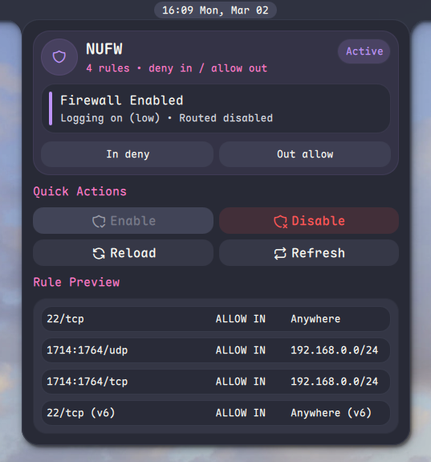

# NUFW

Lightweight UFW firewall controls for Noctalia with a compact bar widget, quick actions, and a readable status panel.

## Features

- Active / inactive firewall state
- Default incoming / outgoing policy visibility
- Logging and routed policy visibility
- Quick actions for enable, disable, reload, and refresh
- Rule preview from `ufw status numbered`
- Lightweight summary polling with slower detailed rule refresh

## Notes

- State reads prefer plain `ufw`, then fall back to `sudo -n` if enabled in plugin settings.
- Privileged reads are enabled by default for compatibility, but polling is now less frequent and detailed reads are slower.
- Mutating actions require `sudo -n` or `pkexec`.
- If neither is available, actions will fail with a visible error message.
